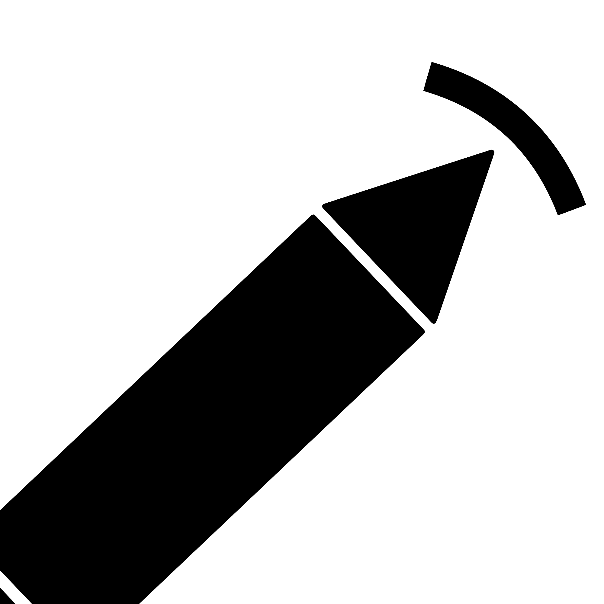

# DrawArc ⚡

**DrawArc** is an AI-powered system architecture studio and interactive cloud blueprint canvas. Describe any application or distributed system in natural language (e.g., *"Design an Instagram clone"* or *"Scalable multi-tenant e-commerce platform"*), and DrawArc autonomously generates a production-ready microservices architecture diagram complete with auto-layout, connected data flows, responsive multi-device support, and high-DPI export capabilities.



---

## 📖 System Design & Architecture

For a deep-dive technical blueprint explaining all architectural decisions, failure modes, data contracts, and scalability specifications, see the full documentation:

👉 **[Read the Full System Design Document (SYSTEM_DESIGN.md)](./SYSTEM_DESIGN.md)**

---

## ✨ Features

- 🤖 **AI Architecture Generation**: Transforms natural language descriptions into 10–20+ node microservices diagrams in seconds using Mistral AI models (`codestral-latest`, `open-mistral-7b`) with native JSON schema enforcement.
- 🔄 **Fault-Tolerant Model Cascading**: Multi-tier failover between Mistral models and domain-aware resilient local synthesis to guarantee 100% uptime even under upstream API rate-limits.
- 📐 **Automated Graph Layout Engine**: Built-in [Dagre](https://github.com/dagrejs/dagre) hierarchical layout algorithm supporting both **Top-to-Bottom (`TB`)** and **Left-to-Right (`LR`)** orientations with zero-overlap routing.
- 📱 **100% Responsive Design**:
  - **Mobile Drawer Sidebar**: Full slide-over component drawer with backdrop blur on mobile devices.
  - **Tap-to-Add Mode**: Instantly place components on mobile touch screens where native drag-and-drop is unsupported.
  - **Ergonomic Bottom Toolbar**: Floating interaction toolbar anchored at the bottom-center within comfortable reach of mobile thumbs.
  - **Quick Preset Chips**: 1-click architecture templates (`E-Commerce`, `Social Feed`, `WebSocket Chat`, `Streaming`, `Payments`).
- 🧩 **Production Cloud Component Library**:
  - **Clients** (Web SPA, Mobile iOS/Android)
  - **Edge & Gateways** (Cloudflare CDN/WAF, API Gateway, Load Balancers)
  - **Microservices** (Auth, User Service, Business Logic, Async Workers)
  - **Databases & Caches** (PostgreSQL, MongoDB, Redis Clusters)
  - **Streaming & Queues** (Kafka Event Bus, RabbitMQ, SQS)
  - **Object Storage** (Amazon S3, Cloud Storage)
- ✏️ **Interactive Canvas & Vector Drawing Tools**:
  - **Modes**: Pan (`H`), Select/Move (`V`), Rectangle (`R`), Circle (`C`), Diamond (`D`), Text Note (`T`), and Eraser (`E`).
  - **Connecting**: Drag handles to create animated directional data pipelines with custom labels.
  - **Inline Renaming**: Double-click any node to update labels in real-time.
- 📄 **Dual-Format Export**:
  - **High-DPI PDF**: Auto-calculates canvas bounding box and aspect ratio for crisp vector documentation.
  - **PNG Image**: Instant 1-click export for technical RFCs, Notion docs, and Slack.
- 🔒 **Zero-Security-Leakage Guarantee**: API keys remain strictly confined to the server-side Edge route and are never exposed in the client-side JavaScript bundle or git tracking.

---

## 🛠️ Points of the Tech Stack

| Layer | Technology | Architectural Role |
| :--- | :--- | :--- |
| **Framework** | [Next.js](https://nextjs.org/) (`16.2.6`) | App Router and Edge Runtime API for sub-50ms worldwide response latency. |
| **UI Engine** | [React 19](https://react.dev/) (`19.2.4`) | High-performance declarative state management, concurrent rendering, and hooks. |
| **Flow Virtualization** | [React Flow](https://reactflow.dev/) (`11.11.4`) | Virtualized 2D diagramming canvas, smoothstep bezier curves, and custom nodes. |
| **Layout Algorithm** | [Dagre](https://github.com/dagrejs/dagre) (`0.8.5`) | Sugiyama hierarchical layered graph engine for automatic node positioning. |
| **Generative AI** | [Mistral AI](https://mistral.ai/) | High-speed structured JSON inference (`codestral-latest`, `open-mistral-7b`). |
| **Styling & Theme** | [Tailwind CSS v4](https://tailwindcss.com/) | Zero-runtime CSS engine with glassmorphism, responsive utilities, and dark palette. |
| **Iconography** | [Lucide React](https://lucide.dev/) | Consistent icons for cloud primitives, drawing tools, and UI actions. |
| **Client Exports** | `html-to-image` & `jspdf` | Pure client-side rasterization and PDF generation with zero server processing. |
| **Language** | TypeScript (`5.x`) | Complete type-safety across API contracts and canvas components. |

---

## 🚀 Getting Started

### Prerequisites

- [Node.js](https://nodejs.org/) (v18.17 or higher recommended)
- `npm`, `pnpm`, or `yarn`
- A [Mistral AI API Key](https://console.mistral.ai/)

### Installation

1. **Clone the repository:**
   ```bash
   git clone https://github.com/dp2005317/Draw_Arc.git
   cd Draw_Arc
   ```

2. **Install dependencies:**
   ```bash
   npm install
   ```

3. **Configure Environment Variables:**
   Copy `.env.example` to `.env.local`:
   ```bash
   cp .env.example .env.local
   ```
   Add your Mistral AI key to `.env.local`:
   ```env
   MISTRAL_API_KEY=your_mistral_api_key_here
   ```
   *(Note: `.env.local` is strictly excluded in `.gitignore` to prevent secret leakage).*

4. **Run the development server:**
   ```bash
   npm run dev
   ```

5. **Open in your browser:**
   Visit [http://localhost:3000](http://localhost:3000).

---

## ⌨️ Available Scripts

- `npm run dev` — Starts local development server on port 3000.
- `npm run build` — Builds the optimized production application with Turbopack.
- `npm run start` — Starts the production server.
- `npm run lint` — Runs ESLint code quality checks.

---

## 🌐 Deployment (Vercel)

DrawArc is pre-configured for instant zero-configuration deployment to [Vercel](https://vercel.com):

1. Push your repository to GitHub (`git push origin main`).
2. Import the project in Vercel.
3. In Project Settings ➔ **Environment Variables**, set:
   - `MISTRAL_API_KEY`: Your Mistral AI API key.
4. Click **Deploy**.

---

## 📄 License

This project is open-source and licensed under the [MIT License](LICENSE).
