# DrawArc — Full System Design Document ⚡

## 1. Executive Summary & Purpose

### What Does DrawArc Do?
**DrawArc** is an AI-powered system architecture studio and interactive canvas. It bridges the gap between natural language system requirements and production-grade cloud architecture blueprints. 

When an engineer, tech lead, or software architect types a prompt like:
> *"Design an Instagram clone with high-throughput newsfeed, photo uploads, and real-time notifications"*

DrawArc autonomously parses the requirements and synthesizes an interconnected **10 to 20+ component microservices architecture diagram** in seconds. The generated diagram includes:
- **Clients & Edge Traffic**: Web apps, mobile clients, CDN edge caching, and DDoS mitigation.
- **Routing & Gateways**: Global Load Balancers (ALB/Anycast) and API Gateways (Kong/Envoy).
- **Core Microservices**: Authentication, User Profile, Content Ingestion, Feed Generation, and Notification services.
- **Distributed Caching & Queues**: Redis clusters, Memcached, and Apache Kafka/RabbitMQ message streams.
- **Persistent Data Layers**: Relational primary/replica clusters (PostgreSQL), Document stores (MongoDB), and Object Storage (Amazon S3).
- **Automated Graph Layout**: Nodes and animated directional data pipelines positioned using Dagre's Sugiyama hierarchical graph algorithm.
- **Interactive Studio**: Drag-and-drop primitives, freehand shapes, text annotations, pan/zoom canvas, and 1-click high-resolution PDF/PNG exports.

---

## 2. High-Level Architecture Topology

```mermaid
flowchart TB
    subgraph ClientLayer ["Client Layer (Browser / Mobile / Tablet)"]
        UI["React 19 SPA & Responsive Viewport"]
        Canvas["React Flow Canvas Engine"]
        DagreEngine["Dagre Hierarchical Layout Engine"]
        ExportPipeline["Client-Side Export (html-to-image & jsPDF)"]
    end

    subgraph EdgeLayer ["Edge & Serverless API Layer"]
        RouteHandler["Next.js 16 Edge Route (/api/generate)"]
        PromptEngine["System Prompt & Schema Sanitizer"]
        CascadeManager["Model Cascading & Failover Controller"]
        ResilienceEngine["Domain-Aware Architecture Fallback"]
    end

    subgraph AIEngine ["Mistral AI Inference Cloud"]
        M1["Primary: Codestral Latest"]
        M2["Secondary: Open Mistral 7B"]
        M3["Tertiary: Mistral Small Latest"]
    end

    UI -->|"User prompt or preset chip"| RouteHandler
    RouteHandler --> PromptEngine
    PromptEngine --> CascadeManager
    CascadeManager -->|"Priority 1"| M1
    CascadeManager -.->|"On 429/Error Failover"| M2
    CascadeManager -.->|"On 429/Error Failover"| M3
    CascadeManager -.->|"All remote models exhausted"| ResilienceEngine
    
    M1 -->|"Structured JSON {nodes, edges}"| RouteHandler
    M2 -->|"Structured JSON {nodes, edges}"| RouteHandler
    M3 -->|"Structured JSON {nodes, edges}"| RouteHandler
    ResilienceEngine -->|"Structured Fallback JSON"| RouteHandler

    RouteHandler -->|"JSON Schema Response"| UI
    UI --> DagreEngine
    DagreEngine -->|"Calculated coordinates (X, Y)"| Canvas
    Canvas -->|"Render high-DPI export"| ExportPipeline
```



---

## 3. Points of the Tech Stack Used & Architectural Rationale

| Component | Technology | Version | Architectural Role & Rationale |
| :--- | :--- | :--- | :--- |
| **Framework** | **Next.js** (App Router) | `16.2.6` | **Edge Runtime API & Zero-Config Optimization**: Powers the serverless API routes using the lightweight Edge Runtime. Cold-starts remain under 50ms worldwide, providing instant response times with zero long-running container costs. |
| **UI Library** | **React** | `19.2.4` | **Modern Declarative UI**: Manages the complex state of the interactive canvas, prompt submissions, toast notifications, responsive drawer controls, and dynamic re-rendering. |
| **Diagram Canvas** | **React Flow** | `11.11.4` | **High-Performance Flow Graph Virtualization**: Provides viewport transformations (pan, smooth zoom from 0.08x to 2.5x), animated smoothstep connection lines, multi-handle connection ports, and drag-and-drop primitives. |
| **Layout Algorithm** | **Dagre** | `0.8.5` | **Directed Graph Layout Engine**: Solves the complex mathematical problem of arranging 10–20+ interconnected nodes without overlapping. Implements the Sugiyama layered graph technique to minimize edge crossings. Supports Top-to-Bottom (`TB`) and Left-to-Right (`LR`) layouts. |
| **LLM Inference** | **Mistral AI** | `v1` | **Structured Reasoning Core**: Utilizes Mistral models (`codestral-latest`, `open-mistral-7b`) with native JSON mode (`response_format: { type: "json_object" }`) to output strictly validated graph topologies. |
| **Styling & Design** | **Tailwind CSS** | `4.x` | **Modern CSS Engine & Dark Aesthetic**: Zero-runtime utility styling featuring dark-mode native palette (`neutral-950`), backdrop blur glassmorphism, responsive grid breakpoints, and custom sleek scrollbars. |
| **Icons** | **Lucide React** | `1.17.0` | **Uniform Visual Taxonomy**: Provides high-clarity iconography for cloud primitives (clients, gateways, microservices, databases, queues, caches, storage). |
| **Export Utilities** | **html-to-image & jsPDF** | `1.11.13` / `4.2.1` | **Zero-Server-Load Client Exports**: Rasterizes the React Flow viewport DOM tree at 2x pixel ratio and builds vector-proportioned PDFs and PNGs directly in the user's browser, guaranteeing data privacy. |
| **Type Safety** | **TypeScript** | `5.x` | **End-to-End Type Rigor**: Guarantees typed node and edge data contracts between the AI API response and canvas state. |

---

## 4. Detailed Component & Subsystem Design

### 4.1. Client Canvas Engine (`components/DiagramCanvas.tsx`)
The canvas engine acts as the primary coordinator for:
1. **Viewport & Node State Management**: Coordinates `nodes` and `edges` states using React Flow's `useNodesState` and `useEdgesState`.
2. **Interactive Multi-Mode Drawing System**:
   - `pan`: Allows smooth dragging across infinite 2D space.
   - `select`: Allows selecting, moving, and resizing nodes using the integrated `NodeResizer`.
   - `rect`, `circle`, `diamond`: Adds geometric architecture grouping containers.
   - `text`: Places inline editable markdown notes and annotations.
   - `eraser`: One-click deletion of nodes and connecting data pipelines.
3. **Responsive UI Architecture**:
   - **Mobile Drawer Sidebar**: Slides in with a backdrop overlay on small screens; stays docked on desktop.
   - **Tap-to-Add Feature**: Touch devices cannot run native HTML5 drag-and-drop; tapping any component instantly instantiates it at the center of the viewport with collision jitter.
   - **Floating Ergonomic Toolbar**: Anchored at the bottom center (`bottom-4 md:bottom-6 left-1/2`) within easy reach of mobile thumbs and desktop mouses alike.
   - **Quick Architecture Presets**: One-click chip buttons (`E-Commerce`, `Social Feed`, `WebSocket Chat`, `Streaming`, `Payments`) for instantaneous diagram generation without typing.

### 4.2. Cloud Primitive Nodes (`components/nodes/CustomNode.tsx`)
Each cloud primitive node represents a production service block:
- **Quad-Directional Connection Handles**: Anchors at Top, Bottom, Left, and Right allow clean connection lines regardless of whether the diagram is rendered in Top-to-Bottom (`TB`) or Left-to-Right (`LR`) mode.
- **Visual Classification**: Color-coded badges and border glows:
  - *Client*: Blue (Web, Mobile iOS/Android)
  - *Gateway & Load Balancer*: Purple / Indigo (Kong, Envoy, ALB)
  - *Microservices*: Emerald (Auth, User, Feed, Orders)
  - *Databases*: Rose (PostgreSQL, MongoDB)
  - *Caches*: Amber (Redis, Memcached)
  - *Queues*: Orange (Apache Kafka, RabbitMQ)
  - *Storage*: Cyan (Amazon S3, GCS)
  - *Edge/CDN*: Sky (Cloudflare, Fastly)
- **Inline Editing**: Double-clicking any node allows the user to rename or refine its label in place.

### 4.3. Graph Layout Engine (`lib/layout.ts`)
To prevent graph nodes from stacking on top of each other, DrawArc executes a graph layout pass through Dagre:
1. A fresh `dagre.graphlib.Graph()` instance is instantiated per calculation (preventing stale node state).
2. Spacing parameters are calibrated (`nodesep: 60`, `ranksep: 80`, `marginx: 40`, `marginy: 40`).
3. Dagre computes coordinates and shifts the anchor point from Dagre's center-point to React Flow's top-left corner.
4. Smoothstep bezier curves automatically route around intermediate components.

### 4.4. AI Generation & Model Cascading API (`app/api/generate/route.ts`)
The API route operates on the Next.js Edge Runtime:
1. **Input Sanitization**: Validates prompt presence and strips malicious injection vectors.
2. **System Prompt Conditioning**: Enforces a strict Principal Architect persona requiring 10–20 comprehensive nodes with precise typing.
3. **Model Cascading Strategy**:
   - **Tier 1 (`codestral-latest`)**: High-accuracy structured coding model for intricate graph generation.
   - **Tier 2 (`open-mistral-7b`)**: Ultra-fast fallback if Tier 1 hits rate limits or quota constraints.
   - **Tier 3 (`mistral-small-latest`)**: General reasoning model backup.
   - **Tier 4 (Intelligent Local Synthesis)**: If all upstream APIs are temporarily unreachable or rate-limited, DrawArc synthesizes a domain-aware architecture (e-commerce, social, chat, streaming) so the user is never faced with a broken UI.

---

## 5. Data Contracts & JSON Schema

### Architecture Graph JSON Schema
```typescript
export interface ArchitectureNode {
  id: string;
  type: 'custom' | 'shape' | 'text';
  data: {
    label: string;
    type: 'client' | 'gateway' | 'service' | 'db' | 'cache' | 'queue' | 'storage' | 'loadbalancer' | 'cloud';
  };
  position: { x: number; y: number };
}

export interface ArchitectureEdge {
  id: string;
  source: string;
  target: string;
  label?: string;
  animated?: boolean;
}

export interface GenerateArchitectureResponse {
  nodes: ArchitectureNode[];
  edges: ArchitectureEdge[];
}
```

---

## 6. Resilience, Scalability & Security Architecture

### 6.1. Zero-Leakage Security Policy
- **API Key Shielding**: `MISTRAL_API_KEY` is loaded strictly on the server-side Edge route (`process.env.MISTRAL_API_KEY`). It is **never** bundled into the client JavaScript or exposed via headers.
- **Git Protection**: `.gitignore` strictly rules out `.env*` (preserving only dummy `.env.example`).
- **No Persistence Risk**: DrawArc operates statelessly; user prompts are transformed into architecture in-memory and delivered immediately to the browser without being stored in a database.

### 6.2. Scalability Attributes
- **Zero Server State**: Because graph state and canvas editing are completely client-side, the backend API is 100% stateless, allowing horizontal scaling to millions of requests without session synchronization.
- **Edge Deployment**: API endpoints run on Vercel's global Edge network, executing in regions closest to the requesting user.

---

## 7. Responsive Breakpoint Matrix

| Viewport | Device Class | Layout Adaptation |
| :--- | :--- | :--- |
| `< 640px` | Mobile (iPhone, Android) | Sidebar collapses into slide-over drawer; prompt bar simplifies; toolbar floats at bottom with horizontal scroll; presets scroll horizontally; tap-to-add enabled. |
| `640px - 1024px` | Tablet / iPad | Floating prompt bar with compact buttons; sidebar togglable; dual PDF/PNG export active. |
| `> 1024px` | Laptop / Desktop | Full docked sidebar with drag-and-drop; complete keyboard shortcuts; full preset chips; multi-orientation layout switcher (`TB` / `LR`). |

---

## 8. Export Pipeline Specification

DrawArc provides a tri-format client-side export pipeline:
1. **Interactive Excalidraw Schema (`.excalidraw`)**:
   - Converts the React Flow graph into the native Excalidraw virtual whiteboard scene format.
   - Maps cloud nodes to categorized color-coded rectangles/shapes with embedded Virgil hand-drawn typography.
   - Converts graph edges to binding arrows with start/end element bindings and midpoint label annotations.
   - Can be opened or dragged directly into [Excalidraw](https://excalidraw.com) for real-time collaborative sketching and live editing.
2. **High-Resolution PDF (`jspdf`)**:
   - Queries the `.react-flow__viewport` DOM element.
   - Generates an uncompressed high-DPI raster image via `html-to-image` at `pixelRatio: 2`.
   - Calculates aspect-ratio-aware dimensions and automatically assigns portrait or landscape orientation to fit the architecture bounds without clipping.
3. **PNG Image Export (`html-to-image`)**:
   - Instant 1-click rasterized image download for sharing in Slack, Notion, design documents, or technical RFCs.
